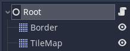

# Demo de tanques de Godot
Demostración creada como recurso de aprendizaje de Godot Engine. Código completamente abierto.

**Usada la extensión para Godot de GitHub.**

[Descarga Godot aquí. Versión del proyecto: 3.4](https://godotengine.org/download)

## Contenidos

- [Introducción al sistema de nodos](#introducción-al-sistema-de-nodos)

- [Godot](#godot)
  - [Cargando el proyecto](#cargando-el-proyecto)
  - [La interfaz del editor](#la-interfaz-del-editor)
    - [El panel de escena](#el-panel-de-escena)
    - [El panel de archivos](#el-panel-de-archivos)
    - [El inspector](#el-inspector)
    - [Las señales y grupos](#las-señales-y-grupos)
      - [Señales](#señales)
      - [Grupos](#grupos)

- [Programación en Godot](#progamación-en-godot)
  - [GDScript](#gdscript)
    - [Variables](#variables)
    - [Constantes](#constantes)
    - [Funciones](#funciones)
    - [Operadores](#los-operadores)
    - [Operadores booleanos](#operaciones-booleanas)
    - [Estructuras de control](#estructuras-de-control)

---

## Introducción al sistema de nodos

Godot emplea un sistema de jerarquía de nodos donde una escena puede ser cualquier rama de nodos. ¿Qué significa esto?

- Los elementos que vas a usar en el juego son siempre nodos. Cada uno tiene su propio tipo.
  

- Los nodos se organizan en forma de árbol. Hay un nodo raíz del cuál se van desplegando en forma de árbol más nodos. **Todo nodo hijo tiene un nodo padre a no ser que sea el nodo raíz.**

- Las escenas son un pequeño árbol de nodos. Esto se usa para tener pequeños árboles de escenas que instanciar o eliminar por código. Por ejemplo, un enemigo podría ser una escena.

Pongamos un ejemplo de un árbol similar a los nodos de Godot.

Tenemos la carpeta Escritorio. Este es el nodo raíz. En otra carpeta tenemos la carpeta "Tarea Marzo" con subcarpetas, esta podría ser en Godot una escena que instanciamos por código, resultando en "Tarea Marzo 1" y "Tarea Marzo 2".

- Escritorio
	
	- Tarea Marzo 1
		
		- ACDA
		- PMDM
		
	
	- Tarea Marzo 2
		
		- ACDA
		- PMDM
			
---
## Godot
### Cargando el proyecto

Nada más abrir todo, nos aparece la pantalla de carga de proyecto:

¿No te aparecen tantos proyectos? No pasa nada, esos proyectos son parte de los que vienen con Godot al descargarlo desde Steam.

Para cargar el proyecto tras descargar el repositorio tienes dos opciones:

- Descomprimirlo, darle a importar y seleccionar el archivo .godot.
- Importar el .zip y seleccionar una carpeta vacía en la que descomprimir el proyecto.

En esta ventana también puedes descargarte proyectos de muestra o crear los tuyos propios.

---
### La interfaz del editor

Una vez cargado el proyecto, verás la interfaz del editor.

Esta es la interfaz que usaremos para hacer juegos. No tiene absolutamente todas las herramientas necesarias, pero sí las dedicadas a funcionalidad del juego. Es decir, no podemos diseñar a nuestros personajes ni el sonido del juego, aunque sí programar cómo se moverán y añadir efectos visuales con shaders y partículas.

Mirando la imagen, lo que más llama la atención es el panel con la escena actual. También, al seleccionar un script, se abrirá ahí el editor de texto integrado en Godot.

> Pro-tip: En el editor de código puedes mantener Control y darle click a un método o clase para ir directamente a su apartado de la documentación.
#### El panel de escena
Este panel situado a la izquierda muestra el árbol de nodos de la escena actual. Para poder ver todo más fácilmente podemos plegar o desplegar cualquier rama de nodos en la escena.

Con click derecho puedes agregar un nodo hijo al nodo seleccionado. Además, con un nodo seleccionado, puedes darle click izquierdo al botón de arriba a la derecha con un símbolo "+" de color verde para añadir un script. Si ya lo tiene, mostrará una "x" roja y lo quitará. Este es el panel:

#### El panel de archivos

Debajo del panel anterior se encuentra el de archivos. En este podemos navegar las carpetas del proyecto. Es recomendable organizar correctamente los archivos del juego para facilitar encontrarlos en el futuro. 

Normalmente, a la carpeta que contiene los recursos del juego (Sprites, Scripts, Escenas, sonido, etc.) se le llama Assets. En proyectos más grandes puede ser recomendable dividir más aún las carpetas.

#### El inspector

El inspector está a la derecha. Podrás ver que al seleccionar un nodo cambia. Esto es porque el inspector muestra las propiedades del nodo que has seleccionado. Las propiedades están organizadas por categorías.

Esto es porque los nodos que puedes usar (e incluso puedes crear los tuyos propios) heredan unos de otros. Es decir, un nodo que hereda de otro tiene las características del nodo "superior", más las suyas propias.

Esto se refiere a la estructura y comportamiento. No es lo mismo un Node2D, que es el nodo genérico para uso en 2D que Node3D, su equivalente en 3D. Sin embargo, ambos tienen unas características en común que heredan de Node, el nodo base de todos los demás tipos.

> Pequeña nota: en el inspector podemos ver también las variables con la palabra clave "export" añadidas en el código. De esta forma podemos darle valor a través del editor. Se puede ver por ejemplo en la captura superior. Los campos Ui Scene y Projectile Scene son variables del script asociado al nodo.

#### Las señales y grupos

Esta es la otra pestaña que está junto al inspector. En este panel podemos ver dos cosas: señales y grupos.

##### Señales

Las señales sirven para notificar de que algo ha ocurrido de uno nodo a otro. Para eso primero hay que hacer que el nodo que va a recibir la señal escuche al nodo que la va a emitir. Esto se hace conectando la señal. Las señales **SIEMPRE** se conectan a una o más funciones. En esa función definiremos que es lo que va a ocurrir cuando se emita la señal. Una señal puede ser presionar un botón en la interfaz, entrar en colisión con algo u incluso puedes definir tus propias señales.

##### Grupos
Los grupos sirven para clasificar nodos. Podemos por ejemplo hacer un grupo de enemigos y que cuando uno nos vea, todos sean alertados. Esta es una de las funcionalidades de los grupos.

---

## Progamación en Godot

#### GDScript

GDScript es el lenguaje de programación principal para Godot Engine. Es similar a Python, con la distinción de que en GDScript es necesario declarar las variables.

Para abrir un Script, busca un nodo que contenga un Script, por ejemplo, Root:

Para abrir el Script asociado, dale click al icono con forma de hoja de papel. También puedes darle click al nodo y en el inspector descender hasta encontrar la propiedad del Script:

### Variables

Las variables sirven para almacenar datos y pueden ser de cualquier tipo. Por ejemplo, es bastante común en videojuegos usar vectores. Dependiendo del tipo de juego, serán vectores 2D o 3D.

Declarando e inicializando después:

	var salud

	salud = 10

O declarando e inicializando en una línea:

	var salud = 10

Variables de otros tipos:

	var x = 10

	var y = 5

	var posicion = Vector2(x, y)

> Los nombres de variables, constantes o funciones **NUNCA** empiezan por un número.

### Constantes

Si lo que necesitas es un valor que no va a cambiar en ningún momento, lo que necesitas usar es una *constante*:

	const VELOCIDAD = 5.0

> Por convenio, las constantes se ponen en mayúsculas.

### Funciones

Si tienes un fragmento de código que necesites ejecutar varias veces, normalmente se crea una *función*:

	func mover():
		self.position += desplazamiento

Las funciones pueden tener parámetros y devolver un valor:

	func sumar(num1, num2):
		return num1 + num2

A la hora de programar debes tener en cuenta la indentación. El código dentro de la función es el código que tiene una tabulación más que la función.

En cuanto hay una línea al mismo nivel que la función (o estructuras de control, en el siguiente paso) significa que ese bloque ha terminado.

Esto es importante, porque las variables solo pueden ser usadas en el bloque en el que se han creado.

	func funcion1():
		var a = 3
	
	# Esto da error
	func funcion2():
		a = 2

### Los operadores

Hay varias operaciones básicas que puedes realizar fácilmente.

	var a := 2
	var b := 3

	# Suma
	var c = a + b 
	# c = 5

	c += a
	# c = 7

	# Resta
	c = b - a
	# c = 1

	c -= a
	# c = -1

	# Multiplicación
	c = a * b
	# c = 6

	c *= a
	# c = 12

	# División entera
	c = b / a
	# c = 1

	c /= a
	# c = 0

	# División
	c = b / 2.0
	# c = 1.5

	c /= 2.0
	# c = 0.75

	# Resto o módulo
	# Es el resto de la división b / a
	c = b % a
	# c = 1

	c %= a
	# c = 1

> Probablemente te hayas dado cuenta del uso de ":=" en vez de "=". Se emplea cuando se inicializa y declara la variable en una misma línea. Lo que hace es impedir que se pueda cambiar el tipo de la variable, lo cuál minimiza el riesgo de errores. Otra forma de hacerlo sería:

	var a : int = 2
	var b : int = 3

	# O si vas a inicializarlas más tarde

	var c : int

	# Se puede hacer con cualquier clase

	var direccion := Vector2(10, -5.0)
	var nombre := "Juan"

	# Lo mismo que

	var direccion2 : Vector2
	var nombre2 : str

	direccion2 = Vector2(10, -5.0)
	nombre2 = "Juan"

### Operaciones booleanas

Son operaciones que devuelven verdadero o falso. Se usan en estructuras de control como if-elif-else o bucles.

	var a := 2
	var b := 3

	# Mayor
	var c = (a > b)
	# c = false

	# Menor
	c = (a < b)
	# c = true

	# Mayor o igual
	c = (a >= b)
	# c = false

	# Menor o igual
	c = (a <= b)
	# c = true
	
	# Igualdad
	c = (a == b)
	# c = false

	# Desigualdad
	c = (a != b)
	# c = true

### Estructuras de control

Si has programado antes ya las reconocerás. La más básica de ellas es el if o sentencia condicional.

	if condicion:
		# Código a ejecutar si se cumple
		...
			
	# El programa sigue por aquí, después del bloque condicional
	...

También existe la sentencia if-else. Si la condición del primer bloque **no** se cumple, se ejecutará el bloque else.

	if condicion:
		# Código a ejecutar si se cumple
		...

	else:
		# Código a ejecutar si no se cumple
		...

	# El programa sigue por aquí, después del bloque condicional
	...

Por último, puedes usar elif. Sirve para evaluar otras condiciones que comprueban si la condición de la sentencia "if" o la sentencia "elif" anterior (en caso de haber varias) **no** se cumplen.

	if condicion:
		# Código a ejecutar si se cumple
		...

	elif otra_condicion:
		# Código a ejecutar si se cumple
		...

	elif otra_condicion_distinta:
		# Código a ejecutar si se cumple
		...

	else:
		# Código a ejecutar si no se cumple nada de lo anterior
		...

	# El programa sigue por aquí, después del bloque condicional
	...

> Importante, la condición tanto aquí como en bucles debe devolver verdadero o falso. Generalmente será una comparación, es decir, si dos valores son iguales, uno es mayor que otro, etc.
